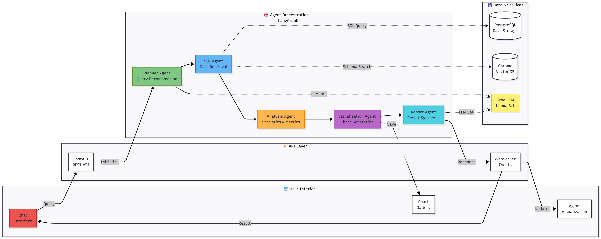
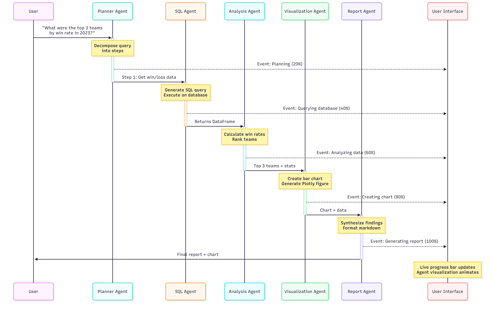

# LangGraph Multi-Agent System

Building a multi-agent system where AI agents work together to analyze data and answer data related questions. It's like having a team of specialized assistants where one breaks down your question, another queries the database, another does the math, and so on.

## Status

Currently building the foundation - event system and agent orchestration layer.

## What This Does

Ask a question in plain English about your data, and watch as different AI agents collaborate to find the answer. The system breaks down complex questions into steps, executes them in sequence, and generates visualizations automatically.

**Example:** "What were the top 5 products by revenue last quarter?"

The system:
1. Figures out what data is needed
2. Writes and runs the SQL query
3. Calculates the metrics
4. Creates a chart
5. Summarizes the findings

All while showing you which agent is working in real-time.

## System Architecture

Here's how everything fits together:



The frontend sends queries to the API, which kicks off the agent pipeline. Each agent does its job and passes results to the next one. The whole time, events stream back to the UI so you can watch the progress live.

## How Agents Work Together

This example shows the system analyzing NBA data, but it works with any structured data - sales, finance, customer analytics, whatever you need.



Each agent:
- **Planner**: Breaks your question into steps
- **SQL**: Gets the data you need
- **Analysis**: Runs calculations and finds patterns
- **Visualization**: Makes charts
- **Report**: Writes up the findings

They pass results down the line, and the UI updates in real-time as each one finishes.

## Tech Stack

| Layer | Technologies |
|-------|-------------|
| **Frontend** | React 18, D3.js, Plotly.js, Tailwind CSS |
| **API** | FastAPI, WebSocket, Uvicorn |
| **Orchestration** | LangGraph, LangChain |
| **Agents** | Custom Python agents with LLM integration |
| **Data Storage** | PostgreSQL, Chroma (Vector DB), Redis |
| **LLM Providers** | Groq (Llama 3.1 70B), OpenAI GPT-4, Anthropic Claude |
| **DevOps** | Docker, Docker Compose |
| **Testing** | pytest, React Testing Library |

## Features

**Real-Time Visualization**
Watch agents light up as they work. The UI shows which agent is active, how far along it is, and what it's doing. Makes the AI process transparent instead of a black box.

**Natural Language Interface**
No SQL required. Just ask your question in plain English and the system figures out how to answer it.

**Chart Gallery**
Every visualization gets saved automatically. Go back and see past analyses or re-run them with updated data.

**Performance Tracking**
See how much each query costs, how long agents take, and which ones succeed or fail. Helps optimize the system over time.

## Project Structure
```
langgraph-multi-agent-system/
├── backend/
│   ├── agents/              # Individual agent implementations
│   ├── orchestration/       # LangGraph state machine and events
│   ├── tools/               # LLM client, vector store, database
│   ├── api/                 # FastAPI routes and WebSocket handlers
│   ├── storage/             # Query history and metrics persistence
│   ├── config/              # Configuration files
│   └── tests/               # Unit and integration tests
├── frontend/
│   └── src/
│       ├── components/      # React components
│       ├── hooks/           # Custom React hooks
│       └── utils/           # Helper functions
├── notebooks/               # Jupyter notebooks for demos
├── data/                    # Charts and vector database storage
├── docs/                    # Documentation
└── logs/                    # Application logs
```

## Development Roadmap

### Phase 1: Foundation (Current)
- [x] Project structure and repository setup
- [ ] Event emission system
- [ ] Agent base class with retry logic
- [ ] State definitions for LangGraph

### Phase 2: Core Agents
- [ ] LLM client abstraction layer
- [ ] Vector store integration
- [ ] Planner agent implementation
- [ ] SQL agent with schema awareness
- [ ] Analysis agent for statistics
- [ ] Visualization agent for charts
- [ ] Report agent for synthesis

### Phase 3: Orchestration
- [ ] LangGraph state machine setup
- [ ] Agent routing and conditional logic
- [ ] Error handling and recovery
- [ ] Comprehensive testing suite

### Phase 4: API Layer
- [ ] FastAPI endpoint implementation
- [ ] WebSocket for real-time updates
- [ ] Query history storage
- [ ] Performance metrics tracking

### Phase 5: Frontend
- [ ] Chat interface component
- [ ] D3.js agent visualization
- [ ] Chart gallery component
- [ ] Performance dashboard
- [ ] System health monitor

### Phase 6: Deployment
- [ ] Docker containerization
- [ ] Docker Compose orchestration
- [ ] Environment configuration
- [ ] Demo materials and documentation

## Setup Instructions

### Prerequisites
- Python 3.11+
- Node.js 18+
- PostgreSQL 14+
- Git

### Backend Setup
```bash
# Clone repository
git clone https://github.com/yourusername/langgraph-multi-agent-system.git
cd langgraph-multi-agent-system/backend

# Create virtual environment
python -m venv venv
source venv/bin/activate  # Windows: venv\Scripts\activate

# Install dependencies
pip install -r requirements.txt

# Configure environment
cp .env.example .env
# Edit .env with your API keys and database credentials

# Run tests
pytest
```

### Frontend Setup
```bash
cd frontend

# Install dependencies
npm install

# Start development server
npm start
```

### Running with Docker
```bash
# From project root
docker-compose up --build
```

## Configuration

System configuration is managed in `backend/config/config.yaml`:

- **LLM Provider Selection**: Choose between Groq (free), OpenAI, or Anthropic
- **Agent Settings**: Customize timeout, retry logic, and behavior
- **Database Configuration**: PostgreSQL connection parameters
- **API Settings**: CORS origins, rate limits, and ports

## Why I Built This

Wanted to learn how to build production-level AI systems, not just demos. This project covers:

- **Multi-agent coordination** - Getting AI agents to work together effectively
- **Real-time systems** - WebSocket communication and live updates
- **Full-stack development** - React frontend + Python backend
- **LLM integration** - Working with multiple providers (Groq, OpenAI, Claude)
- **System design** - Event-driven architecture, state management, error handling

Also shows how different projects can work together - this system can analyze data from my NBA pipeline project, demonstrating how to build interconnected systems.

## Use Cases

The system is flexible enough to analyze different types of data:

- Business analytics (sales, revenue, customer metrics)
- Sports statistics (team performance, player stats)
- Financial data (portfolio analysis, expense tracking)
- Research datasets (experiment results, survey data)
- Operations monitoring (system metrics, error logs)

Basically anything in a database or CSV that you want to query with natural language.

## What's Next

Right now I'm building the core agent system. Once that's solid, I'll add:
- Support for uploading CSV files (not just database queries)
- More chart types (heatmaps, scatter plots, network graphs)
- Ability to save and share analyses
- Better error messages when queries fail
- Mobile-friendly design

Long term, I'd like to add voice input and integrate with tools like Slack for automated reporting.

## License

MIT License - See LICENSE file for details

## Author

Daniel Tietie  


[LinkedIn](http://linkedin.com/in/daniel-tietie-4b0235228) | [Portfolio](https://github.com/Daniel-Tietie) | [Email](tietiedaniel864@gmail.com)

---

**Currently building this as part of my portfolio. Check back for updates as I add features!**
